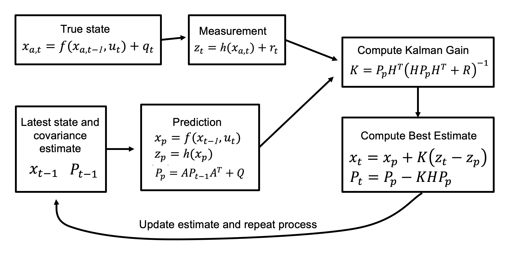

<div align="center">   
  
# Extended Kalman Filter State Estimation for Autonomous Robots
</div>

<h3 align="center">
  <a href="https://arxiv.org">arXiv</a> |
  <a href="https://www.youtube.com/watch?v=u2EER8b3shA">Video</a> |
  <a href="docs/ekf.pdf">Slides</a>
</h3>



## Table of Contents:
1. [Abstract](#abstract)
2. [Anaysis](#analysis)
3. [News](#news)
4. [TODO](#todos)
5. [License](#license)
6. [Citation](#citation)
7. [Resource](#resource)

## Abstract <a name="high"></a>

- :robot: **Localization**: Autonomous mobile robot competitions judge based on a robot’s ability to quickly and accurately navigate the game field. This means accurate localization is crucial for creating an autonomous competition robot. Two common localization methods are odometry and computer vision landmark detection. Odometry provides frequent velocity measurements, while landmark detection provides infrequent position measurements. The state can also be predicted with a physics model. These three types of localization can be “fused” to create a more accurate state estimate using an Extended Kalman Filter (EKF). The EKF is a nonlinear full-state estimator that approximates the state estimate with the lowest covariance error when given the sensor measurements, the model prediction, and their variances.
- :trophy: **EKF**: In this research, we demonstrate the effectiveness of the EKF by implementing it on a 4-wheel mecanum-drive robot simulation. The position and velocity accuracy of fusing together various combinations of these three data sources are compared. We also discuss the assumptions and limitations of an EKF.

## Analysis <a name="analysis"></a>

- We successfully apply an Extended Kalman Filter to “fuse'' odometry and computer vision landmark measurements. 
- The EKF definitely provides good results for a mecanum drivetrain, as quantified by the decrease in RMSE when data is fused, and can be applied to the FTC competition.
- EKF greatly increases localization accuracy while not requiring much computation power

## News <a name="news"></a>

- **`2023/09`** EKF paper is available on arXiv.

## TODO <a name="todos"></a>

- [ ] Implement an EKF on a physical robot with a more realistic model that includes acceleration and other factors such as friction and motor voltages.
- [ ] A more accurate physics model can be obtained by training a machine learning model with human driving.
- [ ] Another state estimation algorithm to look into is the particle filter, as it can perform state estimation on systems with non- Gaussian noise.
- [x] Bugs fix

## License <a name="license"></a>

All assets and code are under the [Apache 2.0 license](./LICENSE) unless specified otherwise.

## Citation <a name="citation"></a>

Please consider citing our paper if the project helps your research with the following BibTex:

```bibtex
```

## Resource

[](https://awesome.re)
- [PID](https://github.com/BubblyBingBong/PID) (:rocket:Ours!)
- Kalman, R. E. (1960). A new approach to linear filtering and prediction problems.
- Franklin, W. Kalman Filter Explained Simply. The Kalman Filter.
- FIRST® (2021). 2021-2022 FIRST® Tech Challenge Game Manual Part 2 – Traditional Events.

